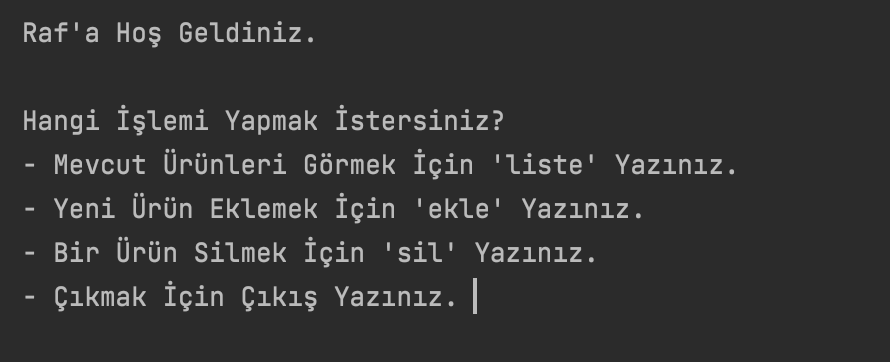

# RAF UYGULAMASI

- Bu uygulama Python programlama dili ile yazılmış basit bir raf uygulamasıdır.

- Uygulama çalıştırıldığında ekranda bir menü açılır. Kullanıcının seçimine göre bu menü sayesinde bazı işlemler yapılır. Yapılacak işlemler aşağıdaki gibidir;

   1. Mevcut bir liste varsa kullanıcı tarafından o listenin içeriği görüntülenir.
   2. Yeni bir liste oluşturulur.
   3. Listeye yeni ürün eklenir.
   4. Listeden ürün silinir.
    
